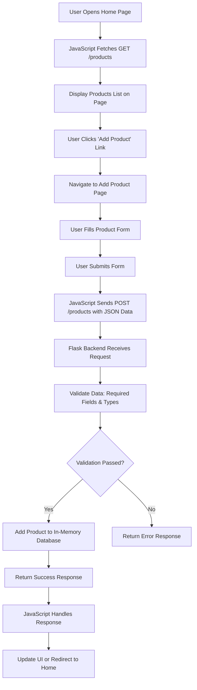

# 🎵 Spotify Clone – Full Stack Project (Flask + JS)

A full-stack Spotify-inspired music web application built using Flask (Python backend) and HTML, CSS, JavaScript (frontend). This project follows academic guidelines including GET & POST APIs, frontend-backend integration, and in-memory data storage.

## 📌 Project Overview

This project demonstrates:
- Full-stack development
- REST API creation using Flask
- Frontend integration using JavaScript (Fetch API)
- DOM manipulation
- Data validation and handling

## 🛠️ Tech Stack

### Frontend
- HTML5 (Semantic structure)
- CSS3 (Responsive UI / Flexbox / Grid)
- JavaScript (DOM + Fetch API)

### Backend
- Python
- Flask (REST APIs)

### Database
- In-memory (Python List / Dictionary)

## 📁 Repository Structure

### Frontend Repository
```
frontend/
│
├── index.html        # Home Page
├── add-product.html  # Add Product Page
├── css/
│   └── style.css
├── js/
│   ├── script.js
│   └── addProduct.js
```

### Backend Repository
```
backend/
│
├── app.py            # Flask App
├── requirements.txt
```

## 🚀 Features Implemented

### ✅ Backend Features (Flask APIs)
- **GET API** → Fetch all products (songs)
- **POST API** → Add new product
- In-memory database (list/dictionary)
- Data validation:
  - Required fields check
  - Data type validation

### ✅ Frontend Features
- 🏠 Home Page with Navbar
- ➕ Add Product Page with Form
- 📡 API Integration using Fetch
- 🎨 Responsive UI Design
- 🧠 DOM Manipulation to display products

## 🔌 API Endpoints

| Method | Endpoint  | Description          |
|--------|-----------|----------------------|
| GET    | /products | Get all songs/products |
| POST   | /products | Add new product      |

## 📋 Project Requirements & Steps

Students are expected to complete the following steps to get maximum score in the project:

1. **Create a GitHub repository for the frontend** – HTML, CSS, JavaScript code.
   - Reference: FS 17 - 1 (Frontend Development - Level 1) - Rishihood

2. **Create a separate GitHub repository for the backend (Flask) code**.
   - Reference: FS 19 - 1 (Backend Development - GET Products) - Rishihood

3. **In the backend application, achieve the following:**
   - a. Basic Setup of Flask App and working GET API. The GET API should return the products information.
     - Reference: FS 19 - 1 (Backend Development - GET Products) - Rishihood
   - b. Create an API to create a new product in the database using POST API. Data sent in body as JSON.
     - Reference: FS 21 - (POST API) - Rishihood
   - c. Store data in an in-memory database like list or dictionary.
     - Reference: FS 21 - (POST API) - Rishihood
   - d. Perform validation on data to check if valid.
     - Reference: FS 21 - (POST API) - Rishihood

4. **In the frontend application, achieve the following:**
   - a. Create a home page with a navbar. Links to Home and Add Product pages.
   - b. In Home page JS, call backend API (localhost) and show products list using DOM manipulation.
     - Reference: FS 22 - (POST API integration with Frontend) - Rishihood
   - c. On Add Product page, form to get product info. On submit, call POST API to add product.

5. **Note:** Update/delete/search operations, SQL database, and live link are optional. Percentage from waived topics reallocated to frontend UI/UX, logic, and functionalities.

## 📊 Evaluation Criteria (Revised)

- **Frontend UI Development (UI/UX) – 15%**
  - Code structure
  - HTML semantics
  - CSS styling
  - Responsive Mobile Design

- **Frontend Feature Development (JS Logic) – 15%**
  - Code structure and logic

- **Backend APIs – 15%**
  - Code structure and logic
  - List/dict to store data
  - Working APIs
  - Basic features (APIs with data validation and CRUD operations)

- **Full Stack App with API Integration – 25%**
  - Frontend-backend integrated and working
  - API Integration
  - Basic features (integrated with frontend, data validation, CRUD operations)

- **VIVA – 30%**

### Optional (Scoring Advantage):
- Update, Delete, Search, Filter APIs
- SQL Database integration
- Lighthouse score
- API latency analysis
- (Deployment) Live link of backend & frontend

**NOTE:** If working on something else, continue and connect with faculty for guidance.

## 🔄 Application Flowchart



## 🚀 Getting Started

### Prerequisites
- Python 3.x
- Flask (`pip install flask`)

### Backend Setup
1. Navigate to `backend/` directory.
2. Install dependencies: `pip install -r requirements.txt`
3. Run the Flask app: `python app.py`
4. Server runs on `http://localhost:5000`

### Frontend Setup
1. Open `frontend/index.html` in a web browser.
2. Ensure backend is running for API calls.

### Usage
- Visit home page to view products.
- Use navbar to add new products.