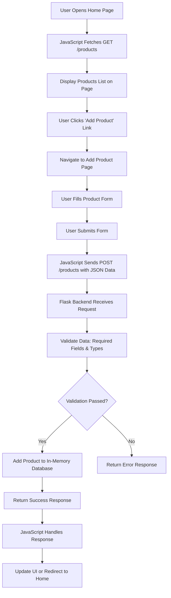

# 🎵 Spotify Clone – Full Stack Project (Flask + JS)

A full-stack Spotify-inspired music web application built using Flask (Python backend) and HTML, CSS, JavaScript (frontend). This project follows academic guidelines including GET & POST APIs, frontend-backend integration, and in-memory data storage.

## 📌 Project Overview

This project demonstrates:
- Full-stack development
- REST API creation using Flask
- Frontend integration using JavaScript (Fetch API)
- DOM manipulation
- Data validation and handling

## 🛠️ Tech Stack

### Frontend
- HTML5 (Semantic structure)
- CSS3 (Responsive UI / Flexbox / Grid)
- JavaScript (DOM + Fetch API)

### Backend
- Python
- Flask (REST APIs)

### Database
- In-memory (Python List / Dictionary)

## 📁 Repository Structure

### Frontend Repository
```
frontend/
│
├── index.html        # Home Page
├── add-product.html  # Add Product Page
├── css/
│   └── style.css
├── js/
│   ├── script.js
│   └── addProduct.js
```

### Backend Repository
```
backend/
│
├── app.py            # Flask App
├── requirements.txt
```

## 🚀 Features Implemented

### ✅ Backend Features (Flask APIs)
- **GET API** → Fetch all products (songs)
- **POST API** → Add new product
- In-memory database (list/dictionary)
- Data validation:
  - Required fields check
  - Data type validation

### ✅ Frontend Features
- 🏠 Home Page with Navbar
- ➕ Add Product Page with Form
- 📡 API Integration using Fetch
- 🎨 Responsive UI Design
- 🧠 DOM Manipulation to display products

## 🔌 API Endpoints

| Method | Endpoint  | Description          |
|--------|-----------|----------------------|
| GET    | /products | Get all songs/products |
| POST   | /products | Add new product      |

## 🔄 Application Flowchart



## 🚀 Getting Started

### Prerequisites
- Python 3.x
- Flask (`pip install flask`)

### Backend Setup
1. Navigate to `backend/` directory.
2. Install dependencies: `pip install -r requirements.txt`
3. Run the Flask app: `python app.py`
4. Server runs on `http://localhost:5000`

### Frontend Setup
1. Open `frontend/index.html` in a web browser.
2. Ensure backend is running for API calls.

### Usage
- Visit home page to view products.
- Use navbar to add new products.
